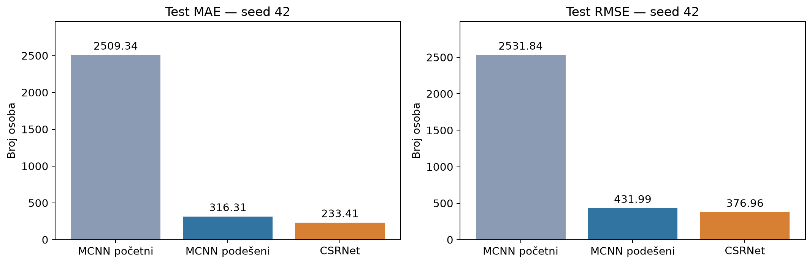
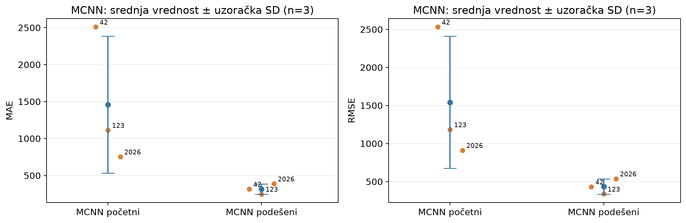
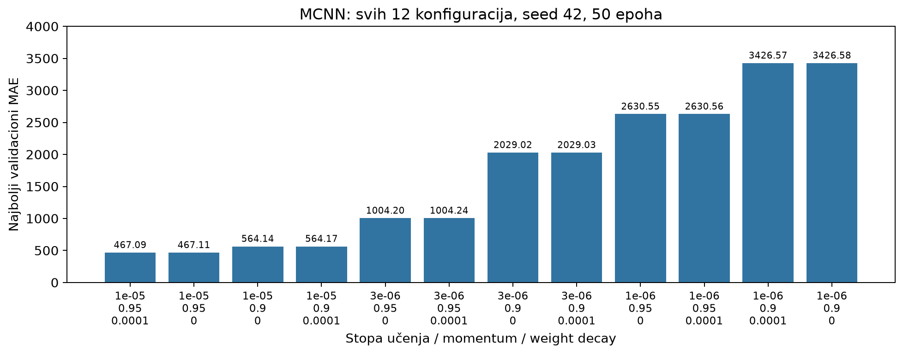

# Poređenje MCNN i CSRNet modela za brojanje ljudi u gužvi

**Autori:** Uroš Dimitrijević, Miloš Kutlešić

**Projektni rad iz predmeta Mašinsko učenje**
**Obuhvat završenih eksperimenata:** ShanghaiTech Part A

## Sažetak

Poređene su dve implementirane mreže za regresiju mape gustine: MCNN i CSRNet-B sa pretreniranim VGG16 frontend-om. U budžetu od 50 epoha sprovedeno je 12 MCNN konfiguracija na seed-u 42 i četiri dodatna treninga za potvrdu početne i izabrane konfiguracije na seed-ovima 123 i 2026. CSRNet je zasebno završen i evaluiran samo na seed-u 42. Na zvanične 182 test slike podešeni MCNN postiže MAE 316.3083 i RMSE 431.9880, a CSRNet MAE 233.4080 i RMSE 376.9634. To su opisni rezultati jednog zajedničkog seed-a, ne dokaz statističke značajnosti ili opšte superiornosti arhitekture. Za Part B nema završenih rezultata u ovom izveštaju.

## 1. Problem i modeli

U gustim scenama okluzija i male dimenzije glava otežavaju detekciju pojedinačnih osoba. Umesto okvira, koristi se mapa gustine čija suma procenjuje broj ljudi. MCNN [1] koristi tri paralelne konvolucione grane različitih receptivnih polja. CSRNet [2] koristi pretrenirani VGG16 frontend i šest dilatiranih konvolucija u backend-u. Konvolucija 3×3 sa dilatacijom 2 ima efektivnu veličinu 5×5, bez povećanja broja težina kernela.

| Osobina | MCNN | CSRNet |
|---|---|---|
| Parametri | 64,385 | 16,263,489 |
| Inicijalizacija | Od nule | ImageNet VGG16 frontend; novi backend |
| Izlazni korak (stride) | 4 | 8 |
| Ulaz | RGB u [0,1] | ImageNet normalizacija |

Lokalni MCNN ima dve konvolucije po grani i fuziju 120 kanala; ne predstavlja se kao tačna reprodukcija svih slojeva i predtreniranja kolona iz rada [1].

Isti podaci i budžet ne izoluju samo arhitekturu: razlikuju se pretreniranje, normalizacija, izlazna rezolucija, kapacitet i postupak podešavanja. Rezultat se odnosi na ove celovite konfiguracije.

## 2. Podaci, ciljne mape i metrike

ShanghaiTech Part A [1,3] ima 300 zvaničnih trening i 182 test slike. Poslednjih 10% **leksikografski sortiranih** trening naziva čini validaciju: 270 trening / 30 validacija. To nije nasumičan niti stratifikovan uzorak; mala validacija može biti nereprezentativna. Svi eksperimenti koriste isti split i isti hash sadržaja trening podataka.

Slike su promenjene na 768×1024 (visinaךirina). Koriste se fiksne Gausove mape sa sigma=15, ispravljena akumulacija mase i keš **v2**. Adaptivni režim postoji u kodu, ali nije korišćen. Izlazne ciljne mape odgovaraju koraku modela uz očuvanje mase. Predikcija i cilj broje se kao `density.sum()`.

Za grešku broja ljudi e_i na slici i, MAE = mean(|e_i|), a RMSE = sqrt(mean(e_i²)). RMSE jače kažnjava velike greške; nije mera varijanse između trening seed-ova i sam po sebi ne dokazuje stabilnost.

## 3. Protokol i poreklo dokaza

- Svaki trening: 50 epoha, batch 4, SGD, srednji pikselni MSE, bez augmentacije, rasporeda stope učenja ili ranog zaustavljanja. `drop_last=True` u treningu; najbolji checkpoint bira se po validacionom MAE.
- MCNN mreža pretrage: lr `[1e-6, 3e-6, 1e-5]` × momentum `[0.90, 0.95]` × weight decay `[0, 0.0001]`. Svih 12 pokušaja je završeno; 600 epoha pretrage. Četiri potvrde dodaju 200 epoha, bez ponavljanja seed-a 42.
- Početna MCNN konfiguracija: `(1e-6, 0.95, 0)`. Pobednik: `(1e-5, 0.95, 0.0001)`, određen **isključivo validacionim MAE**; kod izjednačenja koristi se ID konfiguracije.
- CSRNet: `(1e-5, 0.95, 0)`, seed 42, bez mrežne pretrage. Lokalni CUDA FP32 trening na RTX 4070; sačuvano vreme treninga 1583.2287 s. To nije vreme inferencije niti međuhardverski benchmark.
- Test nije korišćen za rangiranje ove pretrage. Međutim, test rezultati ranijih pilot-eksperimenata već su viđeni: test nije globalno netaknut skup.

Izvor MCNN dokaza je korisnička arhiva `crowd-hyperparameters-results.zip`; originalni JSON/CSV fajlovi su sačuvani pod `evidence/mcnn/`. Svih 48 referenciranih MCNN izveštajnih hash-eva (config/history/summary za 16 treninga) provereno je. Arhiva **ne sadrži težine**: njihove zapisane hash-eve ne predstavljamo kao nezavisno verifikovane težine. CSRNet originali su iz lokalnog direktorijuma `csrnet_local_partA_seed42_e50_b4_lr1e-5_v2_20260917T133646`; njegov kompletan manifest, uključujući oba lokalna checkpoint-a, proverava se pri pripremi, a laki originalni JSON fajlovi čuvaju se u `evidence/csrnet/`. Težine i dataset nisu uključeni u laki paket. Skripta dodatno proverava sačuvane hash-eve, pune istorije i saglasnost metrika.

## 4. Rezultati

### 4.1 Glavno poređenje — seed 42, Part A, 182 test slike

| Konfiguracija | Test MAE | Test RMSE | Najbolja epoha | Validacioni MAE |
|---|---:|---:|---:|---:|
| MCNN početni | 2509.3384 | 2531.8389 | 50 | 2630.5537 |
| MCNN podešeni | 316.3083 | 431.9880 | 50 | 467.0918 |
| CSRNet | 233.4080 | 376.9634 | 31 | 360.9125 |

CSRNet u ovom poređenju ima 26.21% niži MAE i 12.74% niži RMSE od podešenog MCNN-a. Početni MCNN je nedovoljno istreniran u datom budžetu; njegova velika greška nije procena maksimalne sposobnosti arhitekture.



### 4.2 MCNN — odvojena analiza tri seed-a

| Konfiguracija | Seed | Test MAE | Test RMSE |
|---|---:|---:|---:|
| Početni | 42 | 2509.3384 | 2531.8389 |
| Početni | 123 | 1113.4621 | 1183.9319 |
| Početni | 2026 | 753.4451 | 912.1857 |
| Podešeni | 42 | 316.3083 | 431.9880 |
| Podešeni | 123 | 249.3177 | 337.7203 |
| Podešeni | 2026 | 388.2216 | 538.1892 |

| Konfiguracija | MAE: srednja vrednost ± uzoračka SD | RMSE: srednja vrednost ± uzoračka SD |
|---|---:|---:|
| MCNN početni | 1458.7485 ± 927.4737 | 1542.6522 ± 867.3692 |
| MCNN podešeni | 317.9492 ± 69.4665 | 435.9658 ± 100.2936 |

SD koristi imenilac n−1, n=3; nije standardna greška niti interval poverenja. Podešeni MCNN ima manju posmatranu varijabilnost. Nema odgovarajuće troseed analize za CSRNet: njegov jedan rezultat ne treba mešati sa MCNN prosekom u glavnoj tabeli niti mu pripisivati SD=0.



### 4.3 Pretraga i dinamika učenja



Pobednički validacioni MAE je 467.0918; ista stopa učenja i momentum bez weight decay daju 467.1052. Razlika je samo **0.0135 MAE**. To je numerički pobednik, ne ubedljiv dokaz koristi regularizacije. Ne sprovodimo test statističke značajnosti. Svih 12 konfiguracija imaju najbolju epohu 50, na granici budžeta: nije dokazana konvergencija. Pretraga poredi budžet epoha, ne identično vreme izvršavanja niti konačne optimume.


CSRNet ima minimum validacionog MAE u epohi 31. Za tumačenje kasnijih oscilacija koriste se originalne pune krive, a ne ranije ručno prepisani nizovi. Ranije tvrdnje o glatkom rastu posle epohe 34 nisu dokaz za ovaj eksperiment. Razlika između validacionog i test MAE ne dokazuje grešku pipeline-a, ali bez analize distribucija ne pripisujemo je pouzdano samo veličini split-a.

## 5. Ograničenja i zaključak

CSRNet je bolji po oba test kriterijuma u izvedenom poređenju seed-a 42, dok MCNN snažno zavisi od stope učenja i inicijalizacije u budžetu od 50 epoha. To ne potvrđuje univerzalnu superiornost, statističku značajnost niti bolju stabilnost CSRNet-a. MCNN je dodatno podešavan, CSRNet nije; pretraga troši dodatni trening budžet. Izostanak augmentacije, fiksne mape i ograničen trening razlikuju ovaj rad od originalnih protokola. Ti faktori ne moraju jednako uticati na modele; uzroci odstupanja od literature nisu izolovani ablacijama.

Budući rad: CSRNet seed-ovi 123 i 2026, Part B, duži trening, augmentacija, adaptivne mape, raspored stope učenja, reprezentativnija validacija i posebno merenje inferencije. Za njih ovde nema završenih rezultata. Istorijske beleške 19 i 20 zadržane su kao pilot-evidencija, ne kao važeći finalni rezultati. Ocena projekta ili predaja nastavniku nisu potvrđene ovim eksperimentima.

## 6. Reprodukcija

Iz korena repozitorijuma, bez treninga, GPU-a ili dataseta:

```bash
uv sync --locked
uv run --locked python scripts/plot_training_curves.py
uv run --locked python -m pytest tests/
cd presentation
tectonic --keep-logs presentation.tex
```

Tectonic se instalira zasebno; prvo pokretanje preuzima TeX resurse. Potpuna XeLaTeX instalacija (dva prolaza) je alternativa. Lokalni sistemski XeLaTeX nema generisan format, pa je finalni PDF uspešno izgrađen Tectonic-om.

Skripta izvodi `results_summary.json` i četiri grafikona u `reports/figures/` (isti fajlovi se koriste u prezentaciji) iz uključenih originala. Protokol, komande novog treninga, potvrda i evaluacije su u [uputstvu](../docs/hyperparameter-search.md). Novi trening koristi zaseban izlazni direktorijum; izveštajni paket bez težina nije dovoljan za nastavak treninga ili ponovnu inferenciju. Za glavno poređenje MCNN težine treba pribaviti iz originalnog Drive-a ili ponoviti trening.

## 7. Literatura

1. Zhang, Y., Zhou, D., Chen, S., Gao, S., & Ma, Y. (2016). *Single-Image Crowd Counting via Multi-Column Convolutional Neural Network*. CVPR. https://openaccess.thecvf.com/content_cvpr_2016/html/Zhang_Single-Image_Crowd_Counting_CVPR_2016_paper.html
2. Li, Y., Zhang, X., & Chen, D. (2018). *CSRNet: Dilated Convolutional Neural Networks for Understanding the Highly Congested Scenes*. CVPR. https://arxiv.org/abs/1802.10062
3. ShanghaiTech dataset, Kaggle distribucija: https://www.kaggle.com/datasets/tthien/shanghaitech
