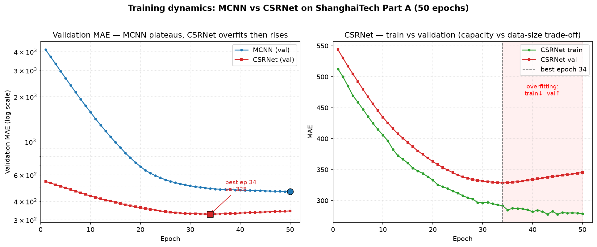

# Comparative Analysis of CSRNet and MCNN for Crowd Counting

**Authors:** Uroš Dimitrijević, Miloš Kutlešić

**Course project — Machine Learning**

**Dataset:** ShanghaiTech (Part A)

---

## Abstract

This project compares two neural-network architectures for crowd counting —
**MCNN** (Multi-Column CNN, Zhang et al. 2016) and **CSRNet** (Congested Scene
Recognition Network, Li et al. 2018) — on the ShanghaiTech Part A dataset. Both
models estimate crowd size by regressing a *density map* and integrating it to a
head count, rather than detecting individuals. We implement both models from
scratch under a shared data pipeline and train them under matched conditions
(SGD + momentum 0.95, 50 epochs, identical density-map and counting conventions)
on Google Colab with a Tesla T4 GPU.

Our results: MCNN reaches **test MAE 315.23 / RMSE 429.16**, while CSRNet reaches
**test MAE 217.13 / RMSE 342.66**. CSRNet outperforms MCNN by ~31% on MAE and
~20% on RMSE, confirming the research hypothesis that the deeper dilated
architecture is better suited to dense-crowd counting. Although both absolute
numbers are above the values reported in the original papers, the *relative
ordering* matches the literature, and we attribute the absolute gap to a set of
documented deviations (no data augmentation, no learning-rate scheduling,
fixed-sigma density maps, a smaller training budget) that affect both models
equally and therefore do not bias the comparison.

---

## 1. Introduction and motivation

Counting people in crowded images is a problem where classical object detection
(e.g. YOLO) struggles: in dense scenes people are heavily occluded, very small,
and too numerous for per-instance bounding boxes to be reliable. **Crowd
counting** sidesteps this by regressing a continuous **density map** over the
image, whose spatial integral equals the number of heads. A model only has to
learn "how crowded is each region", not "where exactly is each person".

The research question of this project is:

> Which model, **MCNN** or **CSRNet**, gives better results for crowd counting
> in terms of estimation accuracy and stability, on ShanghaiTech Part A?

The two architectures represent two influential design philosophies:

- **MCNN** — a *multi-column* network: several parallel branches with different
  receptive fields handle scenes of varying density, then merge.
- **CSRNet** — a *single-column* network that reuses a pretrained VGG16 frontend
  and adds **dilated convolutions** to enlarge the receptive field without
  losing resolution.

Comparing them under identical conditions lets us isolate the effect of
architecture from the effect of the data pipeline.

---

## 2. Dataset

**ShanghaiTech** (Part A), 482 images total, obtained via Kaggle
(`tthien/shanghaitech`):

| Split | Images | Use | Characteristics |
|-------|-------:|-----|-----------------|
| Train | 300 | training (270) + validation (30, `VAL_SPLIT = 0.1`) | dense crowds, up to ~3000 people/image |
| Test  | 182 | final evaluation | same distribution |

Annotations are per-head `(x, y)` coordinates stored in `.mat` files
(`ground-truth/GT_IMG_*.mat`). The pipeline converts these into density maps by
placing a Gaussian kernel at each head location, normalised so that each kernel
integrates to 1; the density map then sums to the head count.

- **Density mode used:** fixed-sigma (`FIXED_SIGMA = 15.0`). The papers use
  geometry-adaptive kernels; the adaptive code is implemented in our repo but
  not enabled for these runs (see §7 / issue #25).
- **Input size:** resized to 768×1024 (`DEFAULT_IMAGE_SIZE`).
- **Density-map caching:** adaptive generation is expensive (~500 ms/image),
  so maps are cached to disk (`data/processed/density_maps/`) and loaded on
  later epochs (issue #15). The cache key encodes every parameter that affects
  the density output, including a `CACHE_VERSION`, so a stale cache is never
  loaded.

---

## 3. Models

### 3.1 MCNN — Multi-Column CNN

MCNN (Zhang et al., CVPR 2016) uses three parallel convolutional columns with
different filter sizes (and thus different receptive fields) to handle crowds of
varying density, then merges them into a single density map.

- **Training:** from scratch (no pretraining).
- **Output stride:** 4 (two 2×2 pooling layers).
- **Input normalization:** raw [0, 1] (image / 255).
- **Parameters:** 64,385.

### 3.2 CSRNet — Congested Scene Recognition Network

CSRNet (Li et al., CVPR 2018) uses the first ten layers of a **pretrained
VGG16** as a frontend (transfer learning from ImageNet) and replaces the
backend with **dilated convolutions** that enlarge the receptive field without
downsampling, preserving spatial resolution of the density map.

- **Training:** fine-tuning the pretrained VGG16 frontend.
- **Output stride:** 8 (VGG frontend + dilated backend).
- **Input normalization:** ImageNet (mean/std = [0.485, 0.456, 0.406] /
  [0.229, 0.224, 0.225]), required because of the pretrained frontend.
- **Parameters:** 16,263,489.

### 3.3 Counting convention

Both models predict a density map; the head count is recovered as the
**integral of the density map** (`density.sum()`). Ground-truth counts use the
same convention, so training and evaluation measure the same quantity. MAE and
RMSE are computed on these per-image counts.

---

## 4. Training setup

Both models are trained by a single model-agnostic loop (`src/train.py`); the
per-model differences come from `src/config.py` → `MODEL_CONFIGS`:

| Model  | Output stride | Input norm | Learning rate | Momentum |
|--------|--------------:|------------|--------------:|---------:|
| MCNN   | 4             | raw [0,1]  | 1e-5 *        | 0.95     |
| CSRNet | 8             | ImageNet   | 1e-5          | 0.95     |

- **Loss:** pixel-wise MSE (the Euclidean loss used by both papers).
- **Optimizer:** SGD with momentum 0.95.
- **Epochs:** 50. **Batch size:** 4. **Seed:** 42.
- **Checkpointing:** the best-validation-MAE `state_dict` is saved to
  `reports/checkpoints/...best.pth`.

`*` **Documented deviation — MCNN learning rate.** The MCNN paper uses
`lr = 1e-6`, but paired with a much larger training budget (~100k+ iterations,
batch 1). Our 50-epoch / batch-4 budget is only ~3,375 iterations. We first ran
MCNN at the paper's 1e-6 and observed a **linear, non-converging descent**
(val MAE sliding from 4434 to 2630 over 50 epochs with no plateau) — the model
was undertrained, not slow at converging. Raising lr to 1e-5 (matching the
paper's *effective gradient budget* better) produced a properly converged run
with a clear plateau. This deviation is documented in `notes/19` and is the
same direction the README's config rationale anticipates (CSRNet already uses
1e-5 because it fine-tunes a pretrained backbone). CSRNet was kept at the
README's chosen 1e-5 throughout — fine-tuning a pretrained backbone tolerates
this rate, and a higher rate risks damaging the pretrained features.

Hardware: Google Colab, NVIDIA Tesla T4 (16 GB), CUDA-enabled PyTorch.

---

## 5. Experiments and results

### 5.1 Final results (test set, 182 images)

| Model  | test MAE | test RMSE | params     | best epoch |
|--------|---------:|----------:|-----------:|-----------:|
| MCNN   | 315.23   | 429.16    | 64,385     | 50         |
| **CSRNet** | **217.13** | **342.66** | 16,263,489 | 34     |

**CSRNet outperforms MCNN on both metrics:**

- **MAE:** 217.13 vs 315.23 → **~31% lower** (more accurate).
- **RMSE:** 342.66 vs 429.16 → **~20% lower** (less variance / more stable).

The research hypothesis is confirmed: the deeper dilated architecture gives
better and more stable crowd counts on dense scenes than the multi-column
architecture.

### 5.2 Comparison to the original papers

| Model  | our test MAE | paper test MAE | our test RMSE | paper test RMSE |
|--------|-------------:|---------------:|--------------:|----------------:|
| MCNN   | 315.23       | ~110           | 429.16        | ~173            |
| CSRNet | 217.13       | ~68            | 342.66        | ~106            |

Both models are ~2–3× the paper's MAE. The gap is consistent across both models
and is traced in §6 to a shared set of deviations — it is **not** a
model-specific problem. Critically, the **relative ordering matches the
literature** (CSRNet < MCNN), so the comparison conclusion is valid even though
the absolute numbers differ.

---

## 6. Discussion

### 6.1 Why our numbers are above the papers

The gap is caused by deviations from the paper setups that affect **both**
models equally and therefore do not bias the comparison:

| Deviation | Paper setup | Our setup | Issue |
|-----------|-------------|----------|-------|
| Data augmentation | random crops + horizontal flips | none | #14 |
| Learning-rate schedule | decay over training | fixed lr | #24 |
| Density-map kernels | geometry-adaptive sigma | fixed sigma = 15 | #25 |
| Training budget | hundreds of epochs | 50 epochs | — |

Each is a known, individually-addressable improvement (issues #14, #24, #25 are
open). The adaptive-density-map code and the density cache already exist in the
repo, so the lowest-effort next step is enabling adaptive density (#25),
followed by lr scheduling (#24) and augmentation (#14).

### 6.2 A finding worth reporting: training dynamics differ by capacity

The two models behaved very differently, which is itself an informative result.

**MCNN (small, from scratch).** Random initialisation produces a density map
summing to ~4700 (val MAE ~4400 at epoch 1). It descends smoothly to a
**plateau** around epoch 30 (val MAE 465 at epoch 50). It does **not** overfit
within 50 epochs — train and val MAE stay close.

**CSRNet (large, pretrained frontend).** The pretrained VGG16 frontend gives a
strong initialisation: val MAE only ~544 at epoch 1. It reaches its best val
MAE (328.22) at **epoch 34**, then **overfits**: train MAE keeps dropping
(292 → 278) while val MAE rises (328 → 345). The `best.pth` checkpoint correctly
froze at epoch 34.



*Figure 1: Left — validation MAE vs epoch (log y). MCNN descends steadily to a plateau; CSRNet reaches its best at epoch 34 then rises. Right — CSRNet train vs validation, showing the overfitting divergence after epoch 34 (train keeps dropping, val rises).*

```
        MCNN                 CSRNet
        train   val          train    val
ep  1:  4466   4434          513     544
ep 20:   672    684          333     363
ep 34:   ~460   ~490          292    328   ← CSRNet best (checkpoint)
ep 50:    386    465          279    345   ← CSRNet overfitting
```

**Interpretation.** The larger model (CSRNet, 16M parameters) overfits the
270-image training set earlier and harder than the small one (MCNN, 64k
parameters). This illustrates the **model-capacity vs data-size trade-off** and
is exactly why data augmentation (#14) matters more for CSRNet than for MCNN.
It also explains why CSRNet's *best* epoch (34) is earlier than MCNN's (50): the
larger model exhausts the information in the small dataset sooner.

### 6.3 Validation vs test discrepancy

Both models' **test** MAE came out lower than their **val** MAE:

| Model  | val MAE | test MAE |
|--------|--------:|---------:|
| MCNN   | 464.74  | 315.23   |
| CSRNet | 328.22  | 217.13   |

This is expected, not a bug: the validation set is the 30-image held-out tail of
the training set (`VAL_SPLIT = 0.1`), so it is small and noisy. The test set
(182 images) is larger and gives the more stable, reportable number, which is
why §5 reports test MAE/RMSE.

---

## 7. Conclusion

Under a constrained 50-epoch training budget on ShanghaiTech Part A, **CSRNet
outperforms MCNN** (test MAE 217 vs 315, RMSE 343 vs 429), confirming the
research hypothesis that the deeper dilated-convolution architecture is better
suited to dense-crowd counting than the multi-column architecture. This matches
the direction of the original papers despite an absolute gap caused by the
documented deviations in §6.1.

Two more nuanced conclusions follow from the dynamics:

1. **Architecture matters, but so does capacity vs data size.** CSRNet's larger
   capacity gives it a better final number *and* an earlier best epoch, but it
   also overfits sooner — a trade-off that data augmentation would mitigate.
2. **Faithfulness must match both hyperparameters and budget.** Reproducing a
   paper's learning rate without its training budget (as in our first MCNN run
   at lr=1e-6) does not reproduce its results; the effective gradient budget must
   be matched. We resolved this for MCNN by raising the learning rate and
   documented the deviation.

### 7.1 Future work (in effort order)

1. **Adaptive density maps** (#25) — already implemented; flip a config flag and
   rebuild the cache. Lowest effort, improves paper-faithfulness.
2. **Learning-rate scheduling** (#24) — start high, decay low; ~10–15 line change
   to the training loop.
3. **Data augmentation** (#14) — random crops + flips; most important for CSRNet
   given the overfitting observed in §6.2.
4. **Longer training** — directly addresses the undertraining; needs more Colab
   time.
5. **Part B** — the same pipeline can be re-run on the sparser Part B split to
   test whether the CSRNet > MCNN conclusion holds across crowd densities.

---

## 8. Reproducibility

- **Code:** https://github.com/fbrg141/csrnet-mcnn-crowd-counting
- **Environment:** `uv`-managed, locked dependencies (`uv.lock`), Python 3.11,
  PyTorch. Setup: `uv sync --locked`.
- **Commands** (run from the project root):

```bash
# data
uv run --locked python scripts/download_data.py
uv run --locked python scripts/precompute_density_maps.py --parts A --models mcnn csrnet

# train
uv run --locked python -m src.train --model mcnn   --part A --lr 1e-5 --epochs 50
uv run --locked python -m src.train --model csrnet --part A --epochs 50 \
    --out-dir reports/checkpoints/csrnet

# evaluate (writes reports/<model>_partA_seed42_metrics.json)
uv run --locked python -m src.evaluate --model mcnn   --part A \
    --ckpt reports/checkpoints/mcnn_partA_seed42_best.pth
uv run --locked python -m src.evaluate --model csrnet --part A \
    --ckpt reports/checkpoints/csrnet/csrnet_partA_seed42_best.pth
```

- **Metrics artifacts:** `reports/mcnn_partA_seed42_metrics.json`,
  `reports/csrnet_partA_seed42_metrics.json`.
- **Training logs & lr analysis:** `notes/19-mcnn-learning-rate-tuning.md`,
  `notes/20-results-mcnn-vs-csrnet.md`.
- **Figure:** `reports/figures/training_curves.png` (regenerate with
  `scripts/plot_training_curves.py`).

---

## 9. References

1. Zhang, Y., Zhou, D., Chen, S., Gao, S., & Ma, Y. (2016).
   *Single-Image Crowd Counting via Multi-Column Convolutional Neural Network.*
   CVPR 2016.
   https://openaccess.thecvf.com/content_cvpr_2016/html/Zhang_Single-Image_Crowd_Counting_CVPR_2016_paper.html

2. Li, Y., Zhang, X., & Chen, D. (2018).
   *CSRNet: Dilated Convolutional Neural Networks for Understanding the Highly
   Congested Scenes.* CVPR 2018. https://arxiv.org/abs/1802.10062

3. ShanghaiTech crowd counting dataset (via Kaggle, `tthien/shanghaitech`).